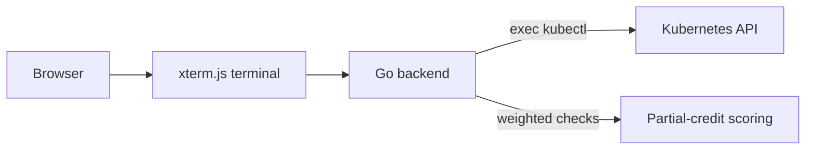

<div align="center">

# ⎈ CKAD Simulator

**A free, open-source practice simulator for the Certified Kubernetes Application Developer (CKAD) exam**

[](#question-bank)
[](#question-bank)
[](LICENSE)
[](https://go.dev)
[](https://react.dev)

*Real tasks · Real cluster · Real kubectl — graded live with partial credit*

</div>

---

## ✨ What is this?

CKAD Simulator is a killer.sh-style exam environment that runs entirely against
a **live Kubernetes cluster**. Every task provisions its own namespace, is
solved with real `kubectl` commands or YAML manifests in an embedded terminal,
and is **graded by inspecting actual cluster state** — not by string matching
your answer.



### Highlights

- 🖥️ **In-browser terminal** — xterm.js with tab completion, pipes, redirects,
  and emulated `vi` / `nano` editors (write YAML without leaving the page)
- 🎯 **Live-cluster grading** — every check runs real `kubectl` queries;
  partially-correct solutions earn partial points
- 🧪 **Self-contained tasks** — each question creates & cleans up its own namespace
- ⏱️ **Exam mode** — 2-hour timer, domain-weighted random selection,
  results hidden until you submit (just like the real thing)
- 📚 **167 questions** from [dgkanatsios/ckad-exercises](https://github.com/dgkanatsios/ckad-exercises), [jamesbuckett/ckad-questions](https://github.com/jamesbuckett/ckad-questions), [ibrahimatay/CKAD-Exercises](https://github.com/ibrahimatay/CKAD-Exercises), [bbachi/CKAD-Practice-Questions](https://github.com/bbachi/CKAD-Practice-Questions), [aleti-pavan/ckad-practice-questions](https://github.com/aleti-pavan/ckad-practice-questions) and [tariqm/CKAD-2026](https://github.com/tariqm/CKAD-2026) across all CKAD domains and three difficulty levels
- 🔍 **Review mode** — after the exam, see exactly which checks failed and why,
  with reference solutions

## 🚀 Quickstart

**Requirements:** [Go 1.26+](https://go.dev/dl/), [Node.js 20+](https://nodejs.org),
[minikube](https://minikube.sigs.k8s.io/docs/start/) and `kubectl`.

```bash
# 1. Start a local Kubernetes cluster
minikube start

# 2. Backend (terminal 1)
cd backend && go run ./cmd/server          # http://localhost:8080

# 3. Frontend (terminal 2)
cd frontend && npm install && npm run dev  # http://localhost:5173
```

Open <http://localhost:5173>, hit **Start a 2-hour exam session**, and good luck! 🍀

## 📊 Question Bank

| Difficulty | Count |
|-----------:|------:|
| Easy       | 31    |
| Medium     | 119   |
| Hard       | 14    |
| **Total**  | **167** |

Sources: [dgkanatsios/ckad-exercises](https://github.com/dgkanatsios/ckad-exercises) · [jamesbuckett/ckad-questions](https://github.com/jamesbuckett/ckad-questions) · [ibrahimatay/CKAD-Exercises](https://github.com/ibrahimatay/CKAD-Exercises) · [bbachi/CKAD-Practice-Questions](https://github.com/bbachi/CKAD-Practice-Questions) · [aleti-pavan/ckad-practice-questions](https://github.com/aleti-pavan/ckad-practice-questions) · [tariqm/CKAD-2026](https://github.com/tariqm/CKAD-2026) — covering core concepts, multi-container pods, pod design (labels, scheduling, deployments, jobs, cronjobs, blue-green, rollout history, strategic patch, debug), configuration (ConfigMaps, SecurityContext, resources, LimitRanges, ResourceQuotas, Secrets including immutable, ServiceAccounts, RBAC, Downward API, projected volumes), observability (probes including startup, logging, JSONPath, debugging), services & networking (ClusterIP, NodePort, Headless, ExternalName, NetworkPolicy including egress/namespace selectors, Ingress with TLS/multiple paths), and state persistence (emptyDir, hostPath, PV/PVC, kubectl cp).

## 🏗️ Architecture

| Piece | Tech | Notes |
|---|---|---|
| Backend | Go + Gin | REST API, session/exam logic, exec-based checker |
| Grading engine | `kubectl` + JSONPath | Weighted checks, invert rules, regex/substring expectations |
| Frontend | React 19 + Vite + xterm.js | Exam UI, terminal, editor emulation, results review |
| State | In-memory | Swap for Redis/Postgres to scale horizontally |

## 🤝 Contributing

Issues and PRs are welcome! Good first contributions:

- New questions in `backend/cmd/server/seed.go` (sourced from [dgkanatsios/ckad-exercises](https://github.com/dgkanatsios/ckad-exercises))
- A persistent session store
- More locales / UI polish

## 📄 License

[MIT](LICENSE)
