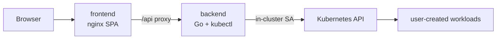

# Deploying CKAD Simulator

The backend grades tasks by running real `kubectl` commands, so it must run
**inside (or with access to) a Kubernetes cluster**. This folder contains
everything needed to ship it to any cloud.



## Files

| File | Purpose |
|---|---|
| `Dockerfile.backend` | Go build → alpine runtime **with kubectl**, non-root |
| `Dockerfile.frontend` | Vite build → nginx serving SPA + `/api` proxy |
| `nginx.conf` | SPA fallback, asset caching, API proxy (300s timeout) |
| `k8s/` | Namespace, RBAC, Deployments/Services (+optional Ingress), kustomize |
| `build.sh` / `deploy.sh` | Build & push images, apply manifests |
| `docker-compose.yml` | Prod-like local test against your host cluster |

## 1. Test locally on minikube (2 minutes)

```bash
./deploy/build.sh                       # builds :local images
minikube image load ghcr.io/manaf/ckad-backend:local
minikube image load ghcr.io/manaf/ckad-frontend:local
./deploy/deploy.sh minikube
minikube service frontend -n ckad-simulator
```

Or without any cluster changes: `docker compose -f deploy/docker-compose.yml up --build`
(mounts your `~/.kube/config`, UI at http://localhost:8082).

## 2. FREE cloud options

### Option A — Oracle Cloud Always-Free VM + k3s ($0 forever) ⭐

Oracle's Always Free tier includes 4 ARM OCPUs / 24 GB RAM that never expires.

1. Create an **A1.Flex VM** (Ubuntu 22.04, 4 OCPU / 24 GB) in a free-tier region.
2. Open ports 22 (SSH) and **30080** in the VCN security list *and* Ubuntu firewall:
   `sudo ufw allow 30080/tcp`
3. Install lightweight Kubernetes:
   ```bash
   curl -sfL https://get.k3s.io | sh -s - --write-kubeconfig-mode 644
   ```
4. From your laptop, push the images to a free registry and deploy:
   ```bash
   docker login ghcr.io                      # your GitHub account
   REGISTRY=ghcr.io/<you> TAG=v1 ./deploy/build.sh --push

   ssh ubuntu@<VM_IP>
   sudo cp /etc/rancher/k3s/k3s.yaml ~/.kube/config && sudo chown $USER ~/.kube/config
   # point kustomization at your registry once:
   #   sed -i 's#ghcr.io/manaf#ghcr.io/<you>#; s/newTag: local/newTag: v1/' deploy/k8s/kustomization.yaml
   ./deploy/deploy.sh
   ```
5. Browse to `http://<VM_IP>:30080`.

### Option B — Oracle OKE (free control plane)

OKE "Basic" clusters cost nothing; use Always-Free A1 node pool, then
`oci ce cluster create-kubeconfig ...` and run `./deploy/deploy.sh`.
Switch the frontend Service to `ClusterIP` + apply `k8s/ingress.yaml`.

### Option C — Civo Cloud ($250 credit ≈ months free)

```bash
civo kubernetes create ckad --nodes=2 --wait
civo kubernetes config ckad --save
REGISTRY=ghcr.io/<you> TAG=v1 ./deploy/build.sh --push
./deploy/deploy.sh
```

### Paid-but-standard paths

* **GKE**: one zonal cluster has the management fee waived — pay only nodes.
* **AKS**: free control plane, ~$30/mo smallest node pool.
* **EKS**: ~$73/mo control plane + nodes.

## 3. Registry & image overrides

Edit **one line pair** in `deploy/k8s/kustomization.yaml`:

```yaml
images:
  - name: ghcr.io/manaf/ckad-backend
    newName: ghcr.io/<you>/ckad-backend
    newTag: v1
```

If the registry is private add a `docker-registry` secret and
`imagePullSecrets` in `backend.yaml`/`frontend.yaml`.

## 4. Security notes (read before going public)

* The backend RBAC is intentionally broad — candidates can create/delete
  resources across the whole cluster. Treat every session as trusted-lab only.
* **Put authentication in front of it.** Quickest: an nginx basic-auth
  snippet or a small oauth2-proxy sidecar in front of the frontend Service.
* Sessions live in memory (`replicas: 1`, `Recreate`) — scale-out needs the
  store swapped for Redis/Postgres first.
* HTTPS: terminate at your ingress controller or a Caddy/Traefik front pod.
